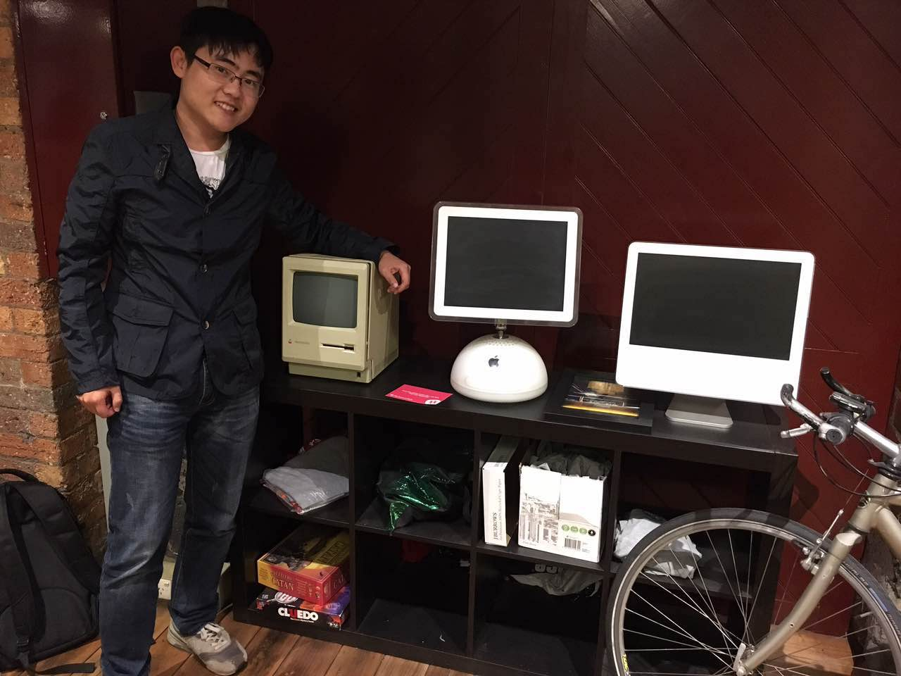



Hi there,

I am a master student in University of Melbourne, major in Software Engineering with Business.

This blog is used to record my daily activities, what I have learnt and the problems(solutions).

If you are interested in any topics of my blogs, you are very welcome to communicate with me either comment or email me. My Email address is on the right side.

Cheers,

Charles